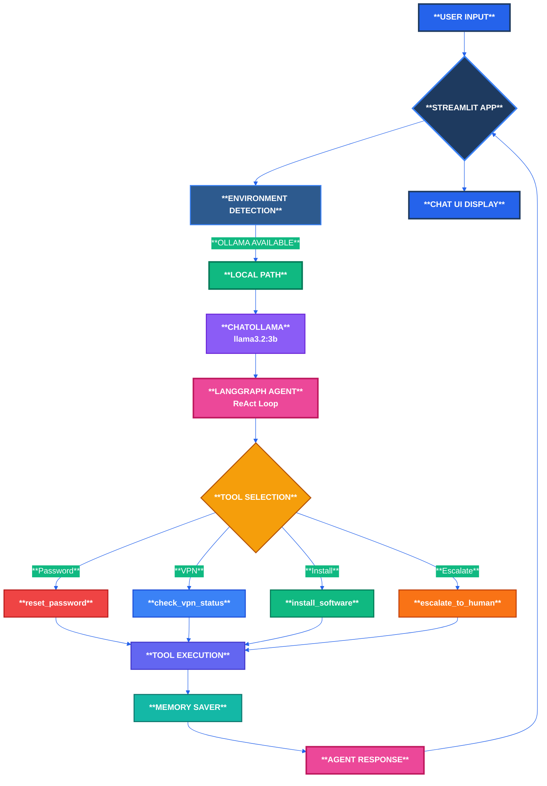
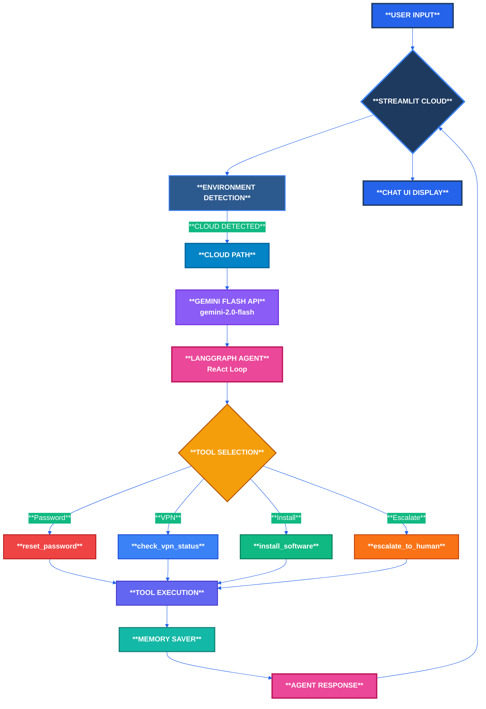
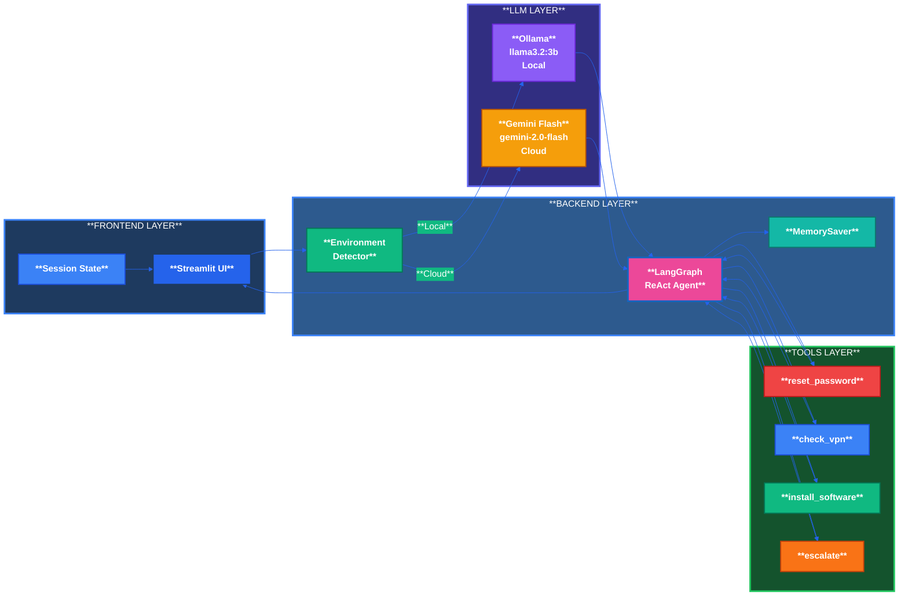
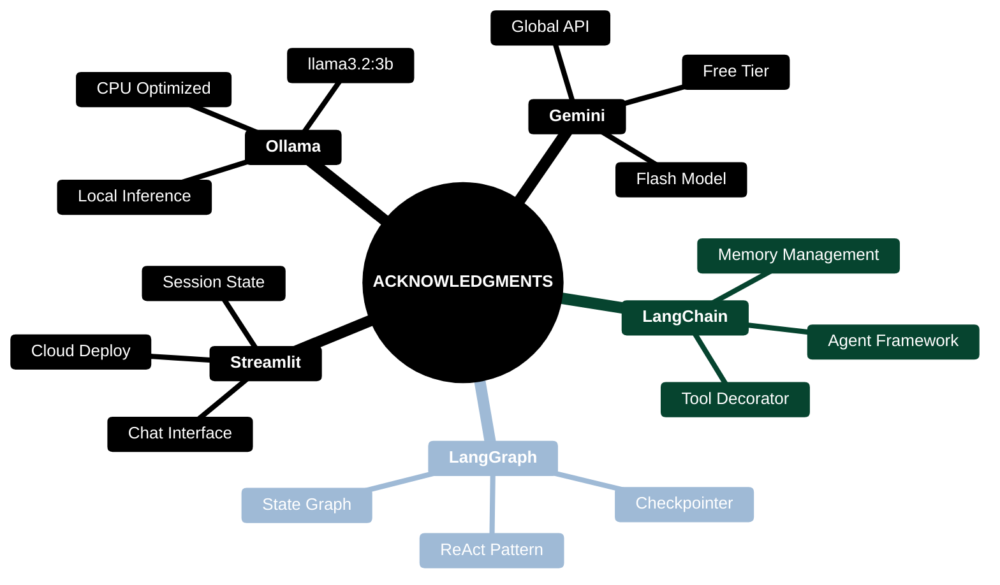

# Nexus IT Assistant

------------------------------------------------------------------------------ 

Built with LangGraph's ReAct pattern.

It runs **locally with Ollama** (free, private) and automatically switches to **Gemini Flash or any other API key anyone wants to use** when deployed to the cloud. 

# Tech Stack

**Frontend** Streamlit 

**Agent Framework**  LangGraph + LangChain 

**Local LLM** Ollama (llama3.2:3b) 

**Cloud LLM**  Google Gemini Flash (Free Tier), also any other API key can be used.

**Memory**  LangGraph MemorySaver 

**Deployment**  Streamlit Cloud 

**Version Control**  Git + GitHub 

------------------------------------------------------------------------------

### Local Deployment Flow (Ollama)

------------------------------------------------------------------------------

# Cloud Deployment Flow

------------------------------------------------------------------------------

## System Architecture

------------------------------------------------------------------------------

# Prerequisites

Python 3.10+

Git

Ollama (for local mode)

----------------------------------------------------------------------------- 

# Local Installation

**1- Clone the repository**

git clone https://github.com/yourusername/nexus-it-assistant.git

cd nexus-it-assistant

**2- Create virtual environment**

python -m venv venv

source venv/bin/activate  # Windows: venv\Scripts\activate

**3- Install dependencies**

pip install -r requirements.txt

**4- Setup Ollama (Local Mode)**

# Install Ollama from https://ollama.ai

Ollama pull llama3.2:3b

ollama serve  # In separate terminal

**5- Run locally**

streamlit run app.py

The app will auto-detect Ollama and use local mode.

## Cloud Deployment

**1- Fork/Clone to GitHub**

**2- Deploy on Streamlit Cloud**

Go to share.streamlit.io

Click "New app"

Select repository and app.py

Click "Deploy"

**3- Add Gemini API Key**

Go to Google AI Studio

Create API key

In Streamlit Cloud: Settings → Secrets

Add:  GEMINI_API_KEY = "your-key-here"

Click "Save" and "Reboot app"

**4- Access your cloud app**

URL: https://your-app-name.streamlit.app

 # Testing

 Test Case	|  Expected Tool
 
 
"I forgot my password"	|  reset_password

"Is VPN working?"	|  check_vpn_status

"How to install Python?"	|  install_software

"Laptop won't start"	|  escalate_to_human

"VPN down and need Slack"	  |  Multi-tool chain

# What You Learn Building This

<table>
  <tr>
    <th width="25%" style="background: #1E3A5F; color: white; padding: 15px; font-size: 18px; border: 3px solid #3B82F6;">LangGraph ReAct</th>
    <th width="25%" style="background: #2D5A8E; color: white; padding: 15px; font-size: 18px; border: 3px solid #3B82F6;">Tool Calling</th>
    <th width="25%" style="background: #1E3A5F; color: white; padding: 15px; font-size: 18px; border: 3px solid #3B82F6;">Environment Detection</th>
    <th width="25%" style="background: #2D5A8E; color: white; padding: 15px; font-size: 18px; border: 3px solid #3B82F6;">Streamlit State</th>
  </tr>
  <tr>
    <td style="background: #F8FAFC; padding: 15px; border: 2px solid #E2E8F0; font-weight: bold;">Agent Reasons</td>
    <td style="background: #FFFFFF; padding: 15px; border: 2px solid #E2E8F0; font-weight: bold;">LLM Decides Autonomously</td>
    <td style="background: #F8FAFC; padding: 15px; border: 2px solid #E2E8F0; font-weight: bold;">Same Codebase</td>
    <td style="background: #FFFFFF; padding: 15px; border: 2px solid #E2E8F0; font-weight: bold;">Session Management</td>
  </tr>
  <tr>
    <td style="background: #FFFFFF; padding: 15px; border: 2px solid #E2E8F0; font-weight: bold;">Selects Tool</td>
    <td style="background: #F8FAFC; padding: 15px; border: 2px solid #E2E8F0; font-weight: bold;">Function Binding</td>
    <td style="background: #FFFFFF; padding: 15px; border: 2px solid #E2E8F0; font-weight: bold;">Local Ollama</td>
    <td style="background: #F8FAFC; padding: 15px; border: 2px solid #E2E8F0; font-weight: bold;">Chat History</td>
  </tr>
  <tr>
    <td style="background: #F8FAFC; padding: 15px; border: 2px solid #E2E8F0; font-weight: bold;">Executes Action</td>
    <td style="background: #FFFFFF; padding: 15px; border: 2px solid #E2E8F0; font-weight: bold;">Parameter Extraction</td>
    <td style="background: #F8FAFC; padding: 15px; border: 2px solid #E2E8F0; font-weight: bold;">Cloud Gemini</td>
    <td style="background: #FFFFFF; padding: 15px; border: 2px solid #E2E8F0; font-weight: bold;">Tool Logs</td>
  </tr>
  <tr>
    <td style="background: #FFFFFF; padding: 15px; border: 2px solid #E2E8F0; font-weight: bold;">Observes Result</td>
    <td style="background: #F8FAFC; padding: 15px; border: 2px solid #E2E8F0; font-weight: bold;">Multi-tool Chaining</td>
    <td style="background: #FFFFFF; padding: 15px; border: 2px solid #E2E8F0; font-weight: bold;">Auto-Switching</td>
    <td style="background: #F8FAFC; padding: 15px; border: 2px solid #E2E8F0; font-weight: bold;">Memory Persistence</td>
  </tr>
  <tr>
    <td style="background: #10B981; color: white; padding: 12px; border: 3px solid #047857; font-weight: bold; font-size: 16px;" colspan="4">API INTEGRATION: OpenAI Compatible | Gemini Endpoint | Ollama Local | Secrets Management</td>
  </tr>
</table>

# Acknowledgments

